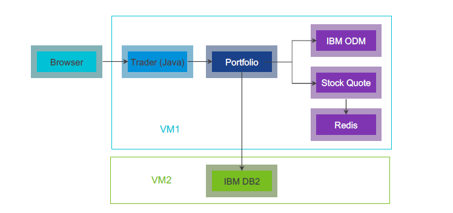

## Deploy containerized Heritage App onto Docker on VMs:
 <p align="center">

</p>
All the applocation components will run  as the docker containers inside docker engine.

#### Components

- Trader - The JSP servlet based UI
- Portfolio - Java microservice to store and retrive the portfolios from the DB2 database
- Stock Quota - Holds the information for the stock quotes for diffrent also uses the Redis cache to store and retrive the stock quotes for faster access.
- IBM ODM - Operation Decesion Manager where we will have the loylty decesion service running to determine the loyelty for particular portfolio
- Redis - Used for caching the data in Stock Quote microservice
- IBM DB2 - To store the Portfolio details for diffrent owners

##### Pre-requisiets:

- 2 Ubantu 16.04 VMs
- Install Docker Engine
- Install Docker compose

##### Install DB2 on VM 2

- Execute the below commads:
  ```bash
  sudo docker pull stocktraders/st-db2
  sudo docker run -itd --name mydb2 --privileged=true -p 50000:50000 -e LICENSE=accept -e DB2INST1_PASSWORD=db2inst1 -e DBNAME=STOCKTRD -v /data:/database stocktraders/st-db2
  sudo docker exec -ti mydb2 bash -c "su - db2inst1"
  ```
 - Check the docker container status with `docker ps`
 
##### Install Stock Trader Componets on VM 1
- Clone the repo  `git clone https://github.com/vmware-ibm-jil/stocktrader-jil-v2.git' 
- Go to installation directory  `cd stocktrader-jil-v2/installation/`
- Edit the docker-compose.yml to update the details for DB2 and RabbitMQ details
- Excute the command - `docker-compose up -d` it will show the progress for services creations and docker network.
- On the successfull execution you can check the conatiners logs as it may take some time for initialization, you can check the ps using the `docker ps` or `docker-compose ps`
- Access the ODM service `http:<Docker-Host>:9060`
- Once it loads click on the link Decision Center Business console and upload the deployemnt service zip file from path 'cd stocktrader-jil-v2/src/portfolio/stock-trader-loyalty-decision-service.zip' in this repo
- Now access the Stock Trader UI using url - `https://<Docker-Host>:9443/trader` 
 
