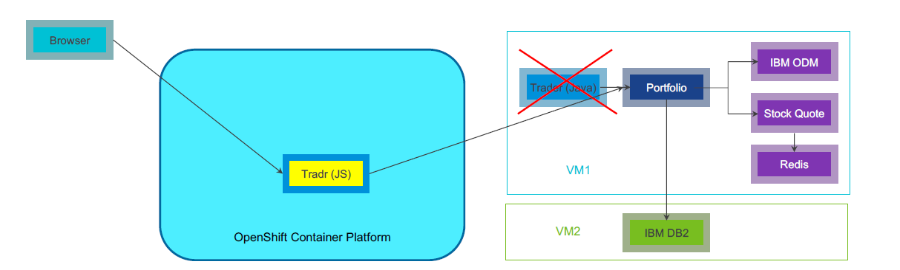

## Deploy containerized Heritage App onto Docker on VMs:
 <p align="center">

</p>
All the application components will run  as the docker containers inside docker engine.

#### Components

- Trader - The JSP servlet based UI- provides user operations - create portfolio, Update Portfolio, Retrieve Portfolio and Delete Portfolio. 
- Portfolio - Java microservice to store and retrieve the portfolios from the DB2 database
- Stock Quote - Provides the information about stock quotes for different symbols. Uses the Redis cache to store and retrieve the stock quotes for faster access.
- IBM ODM - Operation Decision Manager where we will have the loyalty decision service running to determine the loyalty for a particular portfolio
- Redis - Used for caching the data in Stock Quote microservice
- IBM DB2 - To store the Portfolio details for different owners

##### Prerequisites:

- Two ubuntu 16.04 Virtual Machines (_must be netwok connected_)
- Install Docker Engine [link](https://docs.docker.com/engine/install/ubuntu/)
- Install Docker compose [link](https://docs.docker.com/compose/install/)

##### Install DB2 on VM 2:

- Execute the below commads:
  ```bash
  sudo docker pull stocktraders/st-db2
  sudo docker run -itd --name mydb2 --privileged=true -p 50000:50000 -e LICENSE=accept -e DB2INST1_PASSWORD=db2inst1 -e DBNAME=STOCKTRD -v /data:/database stocktraders/st-db2
  sudo docker exec -ti mydb2 bash -c "su - db2inst1"
  ```
 - Check the docker container status with `docker ps`
 - Make sure you are able to telnet VM2 at port 50000 from VM1
 
##### Install Stock Trader components on VM 1:
- Clone the repo  `git clone https://github.com/vmware-ibm-jil/stocktrader-jil-v2.git`
- Go to installation directory  `cd stocktrader-jil-v2/installation/`
- Edit the docker-compose.yml to update the details for DB2 and RabbitMQ details
- Execute the command - `docker-compose up -d` it will show the progress for services creations and docker network. (_prefer adding the timeout with command `COMPOSE_HTTP_TIMEOUT=300 docker-compose up -d` as sometimes it may fail if execution takes more time_)
- On the successful execution, you can check the containers logs as it may take some time for initialization (_use commads `docker-compose logs` or you an check logs for docker containers with `docker logs <container_id>`_), you can check the containers running using the `docker ps` or `docker-compose ps`
- Access the ODM service `http:<Docker-Host>:9060` use credentials (_username: odmAdmin password: odmAdmin_) 
- Once it loads click on the link Decision Center Business console and upload the deployment service zip file from path `stocktrader-jil-v2/src/portfolio/stock-trader-loyalty-decision-service.zip` in this repo
- Now access the Stock Trader UI using URL - `https://<Docker-Host>:9443/trader` (_username: admin password: admin) 

##### Uninstall components on VM 1
- Go to installation directory  `cd stocktrader-jil-v2/installation/`
- Execute the `docker-compose down`
- Check the docker containers are removed `docker ps` 

##### Uninstall DB2 from VM 2:
- Run `docker ps` check the containerid/name for DB2 container
- Execute `docker container stop mydb2`
- Remove the container - `docker container rm mydb2`
 
## Deploy modern UI front-end on OCP
<p align="center">

</p>

##### Prerequisites:
- OpenShift Container Platform (OCP) (_Network connected with VM1 from heritage application_)

##### Installation Tradr UI on OCP
- Clone the repo  `git clone https://github.com/vmware-ibm-jil/stocktrader-jil-v2.git`
- `cd stocktrader-jil-v2/tradr`
- Generate the below secrets 
```bash
kubectl create secret generic trader-host --from-literal=host=https://<VM1_HOST>:9443
kubectl create secret generic portfolio-host --from-literal=host=https://<VM1_HOST>:9442
kubectl create secret generic ingress-host --from-literal=host=https://<OCP_Cluster_Host>:3000
kubectl create secret generic jwt --from-literal=audience=stock-trader --from-literal=issuer=http://stock-trader.ibm.com
```
- Deploy the application with commad `kubectl apply -f mainifest` (_this command will deploy the new Tradr UI_)
- Access the Tradr UI - `https://<OCP_Cluster_Host>:3000/tradr/#/login`
